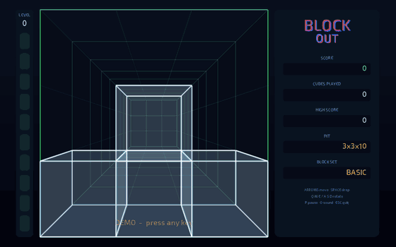

# BlockOut (1989) — decompilation & multiplatform port

BlockOut is a 3D Tetris-like game for DOS (California Dreams / P.Z. Karen Co., 1989).
This repo holds the original DOS release and a reverse-engineered port of it to
portable C + SDL2, so it runs natively on Linux, Windows and macOS, and in a browser
via WebAssembly.



*The original demo AI, ported from the 1989 code, playing 3-D Mania (3×3×10, basic set)
until the pit fills up. [Full-quality video](docs/demo-3x3x10.mp4).*

The goal has two halves:

1. **Game logic: decompiled faithfully.** Piece sets, the random number generator and
   how it is seeded and used, fall speed and level progression, scoring, layer clears,
   rotation and movement rules, and all timings, expressed in the original timer ticks.
   This becomes a deterministic, platform-independent C core. Given the same seed and
   inputs, it should behave exactly like the original under DOSBox.
2. **Presentation: modernized.** Rendering, input and audio are written fresh on top of
   the core. The original EGA/CGA/Hercules drawing code is not ported. It is only read
   where it reveals game rules (e.g. what is shown when).

## Layout

| Path        | Contents |
|-------------|----------|
| `original/` | Untouched DOS release (version `05-26-89`, EGA/CGA/Tandy/Hercules build) |
| `re/`       | Reverse-engineering notes, scripts, Ghidra exports |
| `port/core` | Game logic reconstructed from `BL2.OVL`: plain C, no I/O, deterministic |
| `port/src`  | SDL2 frontend: rendering, input, sound, menus, hall of fame (native and Emscripten) |
| `port/tests`| Replay and bot tools used by the differential tests |

## The original

- `BL.EXE` is a launcher (Turbo C 2.0). It shows the logo and the graphics-mode menu,
  then loads the game.
- `BL2.OVL` is the game itself. It's a standalone Turbo C MZ executable. This is what
  gets decompiled.
- `*.LBM` are IFF/ILBM images per video mode: `_H` = EGA 640×350, `_L` = 320×200
  (EGA low/CGA/Tandy), `_M` = Hercules 720×348.
- `BLOCKOUT.SET` holds saved settings. `BLSCORE.DAT` / `BLSCORE.IDX` (Hall of Fame)
  are created by the game.

## Playing

| Key | Action |
|-----|--------|
| Arrow keys / numpad 8 2 4 6 | move the block |
| Home End PgUp PgDn / numpad 7 1 9 3 | move diagonally |
| Q W E | rotate counter-clockwise (around the three axes) |
| A S D | rotate clockwise |
| Space | drop |
| P | pause, O sound on/off, Esc abort |
| F11 / Alt+Enter | fullscreen |

Menus follow the original (Start Game, Choose Setup, Write Setup, Practice Mode, Demo,
Help), plus a Hall of Fame entry. Leaving a menu alone for a minute starts the demo, as
it did in 1989.

Scores and settings are stored per user (`~/.local/share/BlockOut/BlockOut/` on Linux,
`%APPDATA%\BlockOut\BlockOut\` on Windows, browser storage on the web) in the original
file formats, so `BLSCORE.DAT`, `BLSCORE.IDX` and `BLOCKOUT.SET` from the DOS version can
be copied there (lower-case names).

## Building

Native (Linux, macOS, Windows with any SDL2 package):

```sh
cmake -S port -B port/build
cmake --build port/build -j
./port/build/blockout
```

Browser (Emscripten):

```sh
source ~/tools/emsdk/emsdk_env.sh
emcmake cmake -S port -B port/build-web
cmake --build port/build-web -j --target blockout
cd port/build-web && python3 -m http.server   # open http://localhost:8000/blockout.html
```

The web build is three static files (`blockout.html`, `.js`, `.wasm`) and can be hosted
anywhere. `.github/workflows/pages.yml` builds it on every push to `main` and publishes it
with GitHub Pages (enable it under Settings → Pages → Source: GitHub Actions).

## How faithful is it?

Everything that decides how the game plays was reconstructed from `BL2.OVL` and is
checked against the original machine code:

- `re/emu/` loads the original executable into the Unicorn CPU emulator, stubs out only
  drawing and sound, fakes the BIOS keyboard and timer, and runs the real play loop and
  demo loop headless.
- `re/emu/difftest.py` feeds the same random key scripts (random mashing, a search bot
  that clears layers, pre-filled pits, the demo) to the original and to `port/core`, and
  compares the complete game state on every frame.

  ```sh
  python3 -m venv ~/tools/venv --system-site-packages && ~/tools/venv/bin/pip install unicorn
  ~/tools/venv/bin/python re/emu/difftest.py 60
  ```

That covers piece selection and the Turbo C RNG (including the original's reroll quirk),
movement and wall kicks, the rotation queue, gravity per level, the spawn grace, hard
drop and lock delay, layer clears, scoring, level-ups, practice mode and the demo AI.
Pause, sound toggle, Esc and the hall of fame follow the code but aren't emulator-tested.

Game tables are generated from the binary (`re/tools/gen_tables.py`), so no number was
typed in by hand. Findings and addresses are in [`re/NOTES.md`](re/NOTES.md).

Where the original depended on the machine, the port picks the typical behaviour of a
period PC: 60 Hz logic frames (the original waited for EGA retrace each frame) with the
"fast CPU" animation tables, BIOS key repeat (500 ms, 10.9/s), and sound timings
calibrated so the hall-of-fame tune is in tune. Frame pacing can be lowered to
30/20/15 Hz in Change Setup to mimic slower machines.

## Tooling

| Tool | Used for | Install |
|------|----------|---------|
| DOSBox-X | Running the original as a reference; its debugger is used to inspect game state | `apt install dosbox-x` |
| Ghidra (headless) | Disassembly/decompilation of `BL2.OVL` (x86 16-bit real mode) | zip from GitHub into `~/tools/`, needs `openjdk-21-jdk` |
| Python 3 + capstone, Pillow | Ad-hoc disassembly, ILBM decoding, scripted screenshots | `apt install python3-capstone python3-pil` |
| Xvfb | Headless DOSBox-X runs for automated screenshots | `xvfb-run` |
| gcc + SDL2 + CMake | Native build of the port | `apt install libsdl2-dev cmake` |
| Emscripten (emsdk) | WebAssembly build of the port | `git clone emsdk` into `~/tools/emsdk` |
| Unicorn (pip) | Running original code for differential tests | `pip install unicorn` in a venv |

Ghidra has no prebuilt decompiler for Linux on ARM64. Build it from the bundled sources:
`make -C Ghidra/Features/Decompiler/src/decompile/cpp ghidra_opt sleigh_opt ARCH_TYPE=`
(after `mkdir com_opt ghi_opt sla_opt` there) and copy the two binaries to
`Ghidra/Features/Decompiler/os/linux_arm_64/` as `decompile` and `sleigh`.

## Credits

BlockOut © 1989 P.Z. Karen Co. Development Group / California Dreams. The original files
in `original/` are included for preservation and reference. Font: Exo 2 (SIL OFL).
Text rendering: stb_truetype (public domain).
